# LR6
Лабораторная работа №6
>Дорохин М. А. 4216

## Цель лабораторной работы:
> изучение базовых возможностей системы управления версиями, опыт работы с Git Api, опыт работы с локальным и удаленным репозиторием.

### Клонирование репозитория
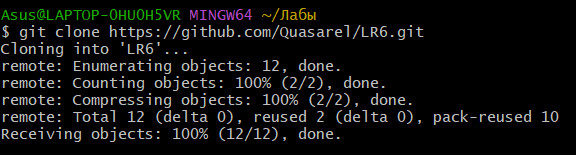

### Настройка имени пользователя и email для репозитория
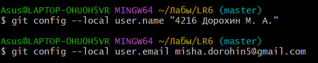

### Создание файла через интерфейс GitHub
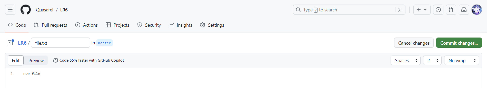

### Подтягивание изменений в локальный репозиторий
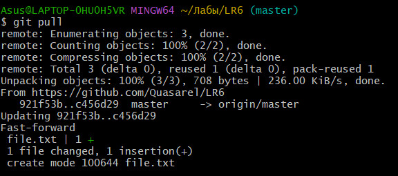

### Создание новой ветки
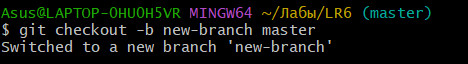

### Моделирование конфликта – изменение файла в двух ветках
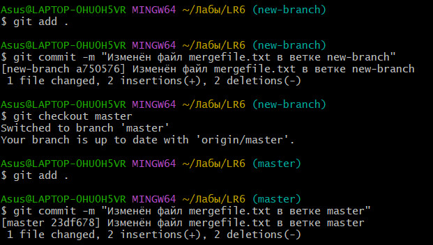

### Просмотр операций в ветке master
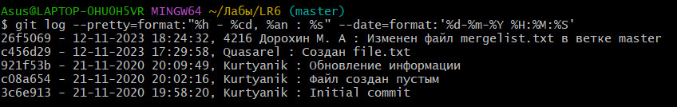

### Просмотр операций в ветке new-branch
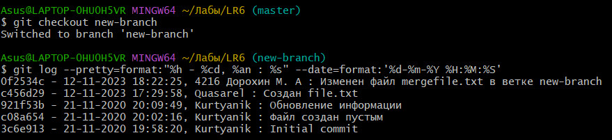

### Попытка слияния веток 
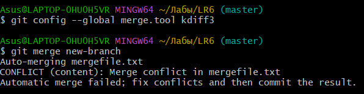

### Вызов инструмента kdiff3 для решения конфликтов
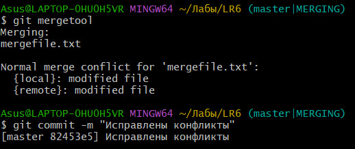

### Решение конфликтов через kdiff3 
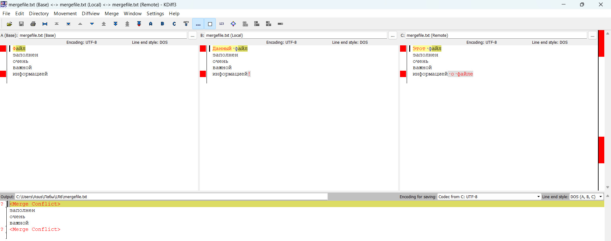

### Результат слияния веток в gitk
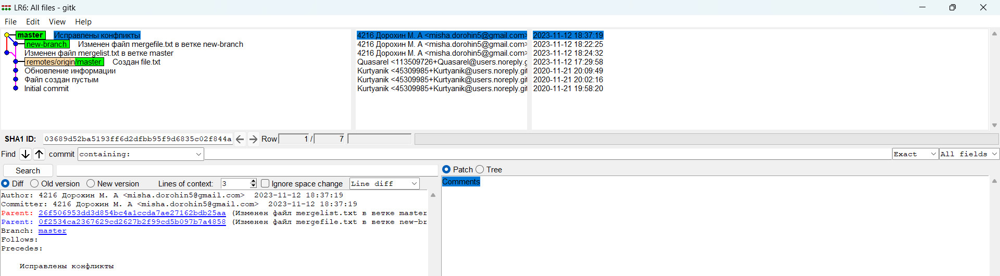

### Удаление ветки new-branch
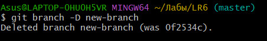

### Статус репозитория после внесения изменений 
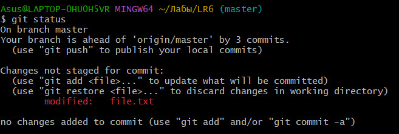

### Коммит с изменениями
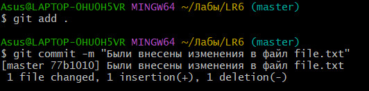

### Откат изменений
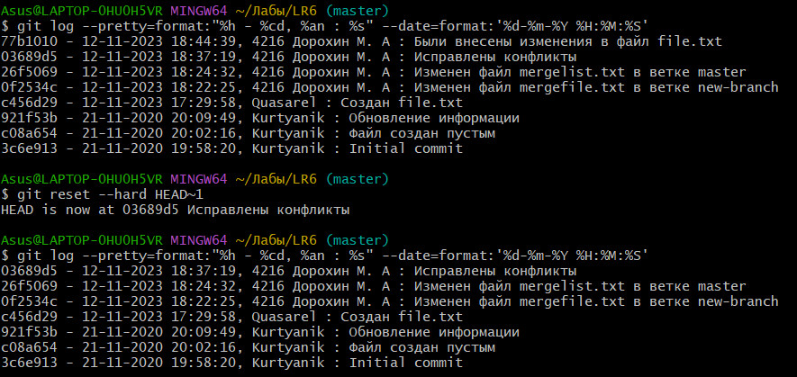

### Финальный коммит
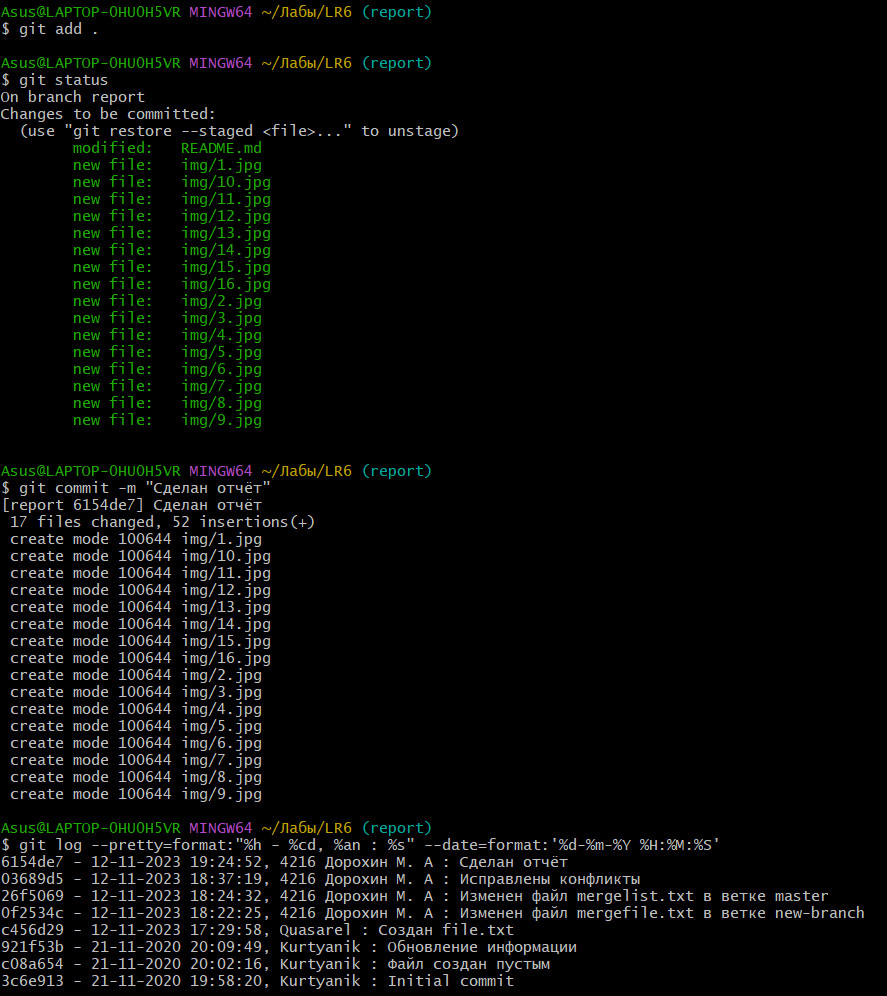